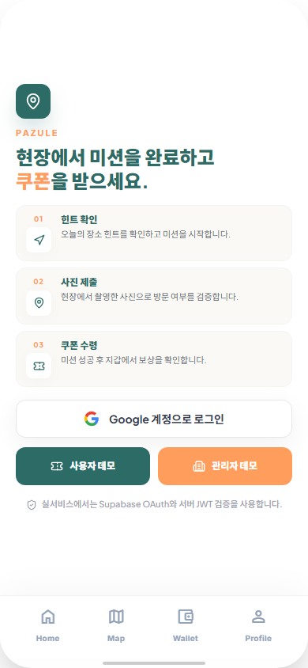
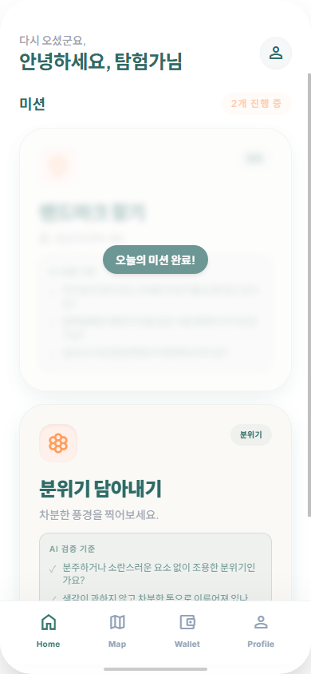
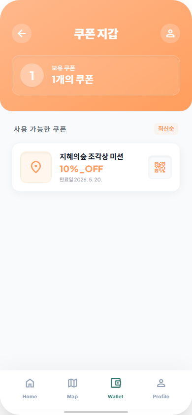
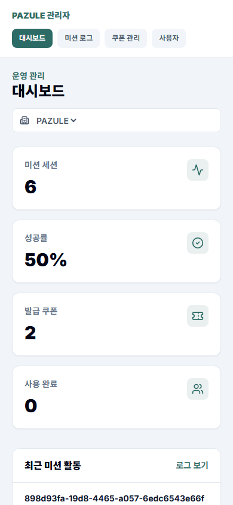
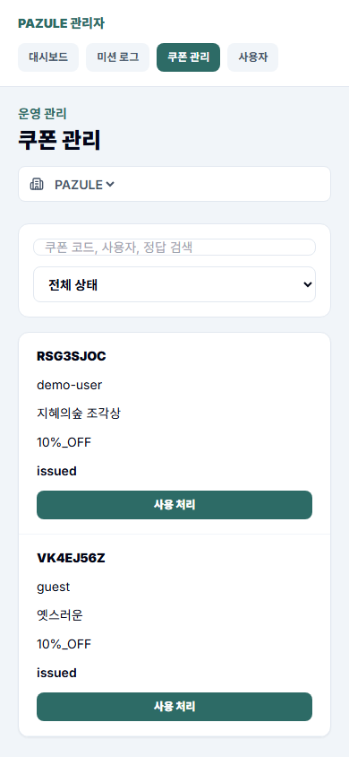

# PAZULE

위치 기반 AI 미션 인증, 쿠폰 발급, 관리자 콘솔을 로컬 데모로 확인할 수 있는 서비스입니다.

[](https://python.org)
[](https://flask.palletsprojects.com)
[](https://react.dev)
[](https://vite.dev)
[](https://github.com/dltkdwns0730/PAZULE_AGENT/actions)

PAZULE은 방문자가 실제 장소에서 사진 미션을 수행하면 GPS, EXIF, 이미지 해시, AI 판정을 거쳐 쿠폰을 발급하는 미션 플랫폼입니다. 관리자 콘솔에서는 기업별 미션 로그, 쿠폰 발급/사용 상태, 사용자 활동을 확인할 수 있습니다.

## Quick Demo

면접관/리뷰어는 별도 API key 없이 데모 모드로 핵심 흐름을 확인할 수 있습니다.

### 1. Clone and Configure

```powershell
git clone https://github.com/dltkdwns0730/PAZULE_AGENT.git
cd PAZULE_AGENT
Copy-Item .env.example .env
```

macOS/Linux:

```bash
git clone https://github.com/dltkdwns0730/PAZULE_AGENT.git
cd PAZULE_AGENT
cp .env.example .env
```

### 2. Start Backend

Windows PowerShell:

```powershell
uv venv
.\.venv\Scripts\Activate.ps1
uv sync --dev
uv run python main.py
```

macOS/Linux:

```bash
uv venv
source .venv/bin/activate
uv sync --dev
uv run python main.py
```

이미 `.venv`가 있다면 가상환경 생성 단계는 건너뛰어도 됩니다.
백엔드는 기본적으로 `http://127.0.0.1:8080`에서 실행됩니다.

### 3. Start Frontend

새 터미널에서 실행합니다.

```powershell
cd front
npm install
npm run dev
```

브라우저에서 `http://localhost:5173`으로 접속합니다.

## What to Test

### 사용자 데모

1. 로그인 화면에서 `사용자 데모`를 클릭합니다.
2. 오늘의 힌트와 미션 화면을 확인합니다.
3. 미션을 시작하고 로컬 이미지 파일을 업로드합니다.
4. 결과 화면과 쿠폰 발급/지갑 흐름을 확인합니다.

### 관리자 데모

1. 로그인 화면에서 `관리자 데모`를 클릭합니다.
2. `/admin` 대시보드에서 미션 요약을 확인합니다.
3. 미션 로그, 쿠폰, 사용자 활동 조회 화면을 확인합니다.
4. 쿠폰 리딤 처리와 기업별 데이터 분리 구조를 확인합니다.

### 리뷰 체크포인트

- 데모 인증: Supabase 없이 `사용자 데모`, `관리자 데모` 세션 생성.
- 미션 검증: GPS, EXIF, 이미지 해시, AI 판정 경계를 분리.
- AI 파이프라인: LangGraph 기반 validator, evaluator, aggregator, judge, policy 흐름.
- 운영 기능: 쿠폰 발급/리딤, 사용자 지갑, 관리자 콘솔, 기업 스코프.
- 품질 관리: pytest, Vitest, ruff, ESLint, GitHub Actions, Docker 구성.

## Demo Screenshots

아래 이미지는 데모 모드에서 실제 구동 화면을 캡처한 것입니다.

| 로그인/데모 진입 | 사용자 미션 홈 |
|---|---|
|  |  |

| 쿠폰 지갑 | 관리자 대시보드 |
|---|---|
|  |  |

| 관리자 쿠폰 관리 |
|---|
|  |

## Demo Mode Notes

`.env.example`은 clone-and-run 데모를 우선 지원합니다.

| 설정 | 데모 기본값 | 의미 |
|---|---|---|
| `PAZULE_ENV` | `development` | 로컬 데모 프로필 |
| `DEMO_AUTH_ENABLED` | `true` | Supabase 없이 데모 토큰 허용 |
| `STORAGE_BACKEND` | `json` | 로컬 JSON 파일로 미션/쿠폰 저장 |
| `SKIP_GPS_VALIDATION` | `true` | 브라우저/백엔드 GPS 검증 우회 |
| `SKIP_METADATA_VALIDATION` | `true` | EXIF/GPS 메타데이터 검증 우회 |
| `BYPASS_MODEL_VALIDATION` | `true` | 실제 모델 추론 대신 데모 판정 사용 |

데모 모드는 제품 흐름 확인용입니다. `BYPASS_MODEL_VALIDATION=true`에서는 실제 SigLIP2/BLIP/Qwen 모델 정확도나 성공률을 평가할 수 없습니다. 실제 모델 검증은 API key와 모델 환경을 설정한 뒤 `BYPASS_MODEL_VALIDATION=false`, `SKIP_METADATA_VALIDATION=false`, `STORAGE_BACKEND=db` 조합으로 확인합니다.

## Current Capabilities

- 사용자 인증: Supabase OAuth/JWT 또는 데모 토큰 기반 로그인.
- 미션 검증: GPS 반경, EXIF, 이미지 해시, SigLIP2/BLIP/Qwen VL 기반 AI 판정.
- 쿠폰 운영: 미션 성공 시 쿠폰 발급, 지갑 조회, 관리자 콘솔 리딤 처리.
- 기업 스코프: `organizations -> sites -> mission_sessions` 구조로 기업별 운영 데이터 분리.
- 관리자 권한: `platform_master`는 전체 조회, 기업 관리자는 소속 기업 데이터 조회.
- 운영 문서: 계정 분류, 설정, 아키텍처, CI/CD, 상용화 검토 문서를 `docs/`에 분리.

## Architecture Snapshot

```text
React SPA
  -> Flask API
  -> Supabase JWT / demo auth
  -> GPS / EXIF / image hash validation
  -> LangGraph AI mission pipeline
  -> mission session and coupon storage
  -> organization-scoped admin console
```

현재 백엔드 API는 [app/api/routes.py](./app/api/routes.py)에 16개 Flask route로 정의되어 있습니다. 프론트엔드 관리자 화면은 `/admin`, `/admin/logs`, `/admin/logs/:missionId`, `/admin/coupons`, `/admin/users` 경로를 사용합니다.

## Tech Stack

| 영역 | 기술 |
|---|---|
| Backend | Python `>=3.10`, Flask `>=2.3`, SQLAlchemy, Alembic |
| Frontend | React 19, Vite 7, React Router, Zustand, Tailwind CSS |
| AI/ML | LangGraph, SigLIP2, BLIP, Qwen VL, OpenAI/OpenRouter/Gemini 연동 |
| Auth/DB | Supabase Auth, Supabase Postgres, JWT 검증 |
| DevOps/Test | uv, pytest, ruff, Vitest, ESLint, GitHub Actions, Docker |

## Verification

```bash
uv run pytest
uv run ruff check .

cd front
npm run build
npm run lint
npm test
```

테스트 실행 기준과 커버리지 설정은 [tests/README.md](./tests/README.md)에 정리되어 있습니다.

## Project Structure

| 경로 | 역할 |
|---|---|
| [app/](./app/README.md) | Flask API, LangGraph 파이프라인, 서비스, DB/Auth 경계 |
| [front/](./front/) | React 사용자 앱과 관리자 콘솔 |
| [tests/](./tests/README.md) | pytest 백엔드 테스트와 테스트 작성 기준 |
| [scripts/](./scripts/README.md) | Supabase 검증, 벤치마크, 운영 보조 스크립트 |
| [docs/](./docs/README.md) | 현재 상태 기준 설계, 운영, 상용화, 작업 기록 문서 |

## Docs Map

| 문서 | 내용 |
|---|---|
| [Architecture](./docs/architecture.md) | LangGraph 파이프라인과 현재 시스템 구조 |
| [Commercialization Plan](./docs/commercialization-plan.md) | 현재 제품 구조 기준 상용화 검토 |
| [CI/CD Pipeline](./docs/ci-cd-architecture.md) | GitHub Actions, Docker, ghcr.io 패키징 구조 |
| [Admin Company Account Classification](./docs/admin-company-account-classification.md) | 기업별 관리자 계정 분류와 Supabase SQL 작업 절차 |
| [Task Index](./docs/TASK_INDEX.md) | 작업 문서 인덱스 |
| [Documentation Guide](./docs/doc-guide.md) | 문서 작성 규칙 |

## Project Status

- 사용자 미션은 Supabase OAuth 또는 데모 인증 후 서버가 검증한 사용자 ID를 기준으로 소유권을 관리합니다.
- 운영 데이터는 기업 단위로 분리되며, 플랫폼 마스터는 전체 기업을 조회할 수 있습니다.
- 쿠폰과 미션 세션은 `STORAGE_BACKEND` 설정에 따라 JSON 또는 DB 저장소 경계를 사용합니다.
- 현재 설정 기본값은 위치 임계값 `0.70`, 분위기 임계값 `0.35`, 세션 TTL `60`분, 최대 제출 `3`회, 위치 반경 `300m`입니다.
