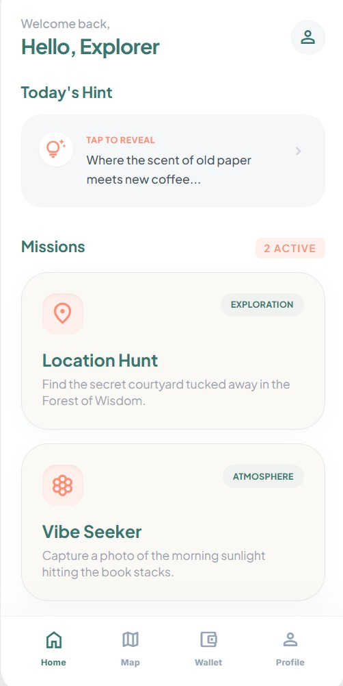
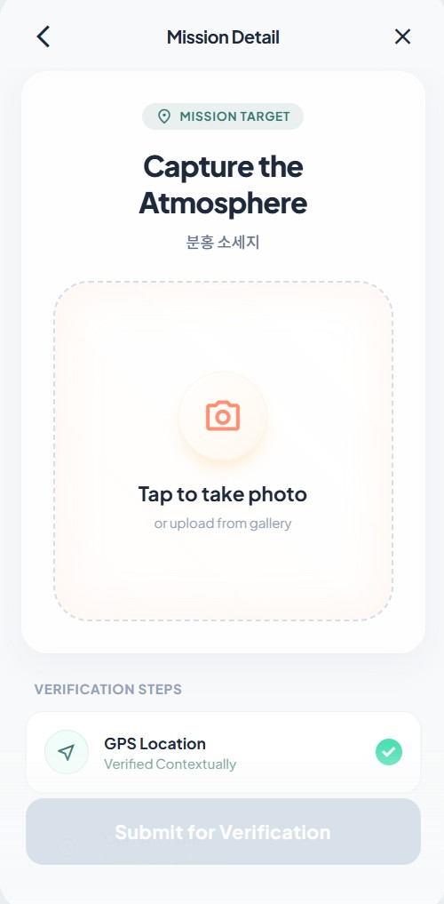
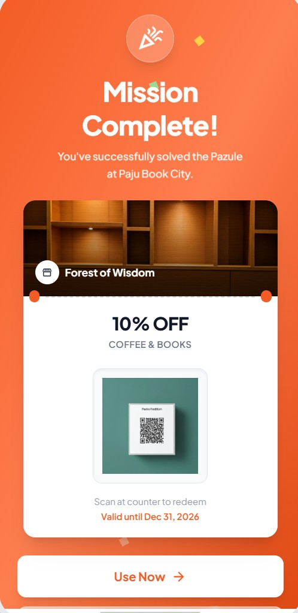
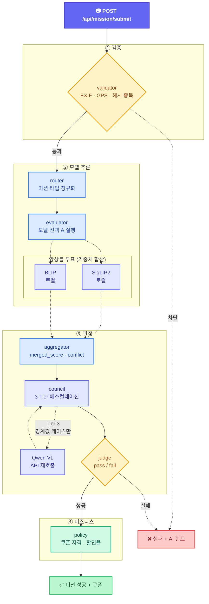

<div align="center">

# PAZULE
**사진 한 장으로 장소와 분위기를 검증하는 AI 미션 플랫폼**

[](https://python.org)
[](https://fastapi.tiangolo.com)
[](https://react.dev)
[](https://langchain-ai.github.io/langgraph/)
[](https://github.com/dltkdwns0730/PAZULE_AGENT/actions)
[](LICENSE)

사용자가 업로드한 사진을 여러 비전 모델이 앙상블 투표로 검증하고,<br/>
미션 성공 시 파트너 쿠폰을 자동 발급하는 위치 기반 미션 플랫폼입니다.

[시작하기](#getting-started) &nbsp;&bull;&nbsp; [아키텍처](#architecture) &nbsp;&bull;&nbsp; [기술 결정](#key-technical-decisions) &nbsp;&bull;&nbsp; [시연](#demo) &nbsp;&bull;&nbsp; [팀](#team)

</div>

---
## Front UI

<div align="center">

| 메인 화면 | 미션 제출 | AI 분석 성공 | 미션 완료 |
| :---: | :---: | :---: | :---: |
|  |  |  |  |

</div>

## Overview

파주 출판단지 보물찾기 이벤트용 팀 프로젝트(**파주시장상** 🏆)가 시작이었습니다.

**v1에서 드러난 한계:**
- **오탐** — 비슷한 외관의 건물 앞 사진이 단일 모델에서 통과하는 경우 발생
- **어뷰징** — 미션 상태를 서버가 관리하지 않아 같은 사진 반복 제출이 가능

이 버전은 수상작 기반으로, 위 한계를 개인적으로 고친 결과물입니다.

| | v1 · 수상작 | v2 · 현재 |
|---|---|---|
| 모델 | BLIP-VQA + CLIP (분리 실행) | SigLIP2 + BLIP (앙상블 투표) + Qwen VL (재검증) |
| 파이프라인 | `mission_manager.py` 단일 호출 | LangGraph 8노드 오케스트레이션 |
| API | `POST /mission` 1개 | `start / submit / issue / redeem` 4개 |
| 레포 | [`PAZULE`](https://github.com/dltkdwns0730/PAZULE) | [`PAZULE_AGENT`](https://github.com/dltkdwns0730/PAZULE_AGENT) |

---

## Architecture



**하네스 구조:**
- LangGraph `StateGraph`가 하네스 역할 — 각 노드는 공유 상태(`PipelineState`)를 읽고 결과를 기록
- 노드 간 직접 호출 없음 — 조건 분기와 에러 누적은 하네스가 중앙에서 통제
- **조기 종료** — validator 실패 시 모델 추론 건너뜀 / judge 실패 시 힌트 경로로 분기

> 상태 흐름, control_flags, Council 3-Tier 에스컬레이션 등 상세 설계는 [`docs/architecture.md`](./docs/architecture.md)를 참고하세요.

---

## Key Technical Decisions

### 1. 분리 모델 → 앙상블 투표

**문제:**
- BLIP-VQA(장소) + CLIP(분위기)을 각각 로딩 — 추론 비용 2배
- CLIP이 무거워서 로컬 환경에서 응답 시간·메모리 모두 부담
- 각 모델이 독립 판정 — 한쪽 오탐 시 보정 수단 없음

**대안 검토:**
- CLIP 유지 + 경량화 시도 → 근본적 한계 (모델 구조 자체가 무거움)
- SigLIP2로 CLIP 대체 → 동일 태스크(zero-shot 매칭)에서 더 가볍고 빠름
- Qwen VL을 API로 추가 → 로컬 리소스 부담 없이 정확도 보강

**선택:**
- SigLIP2(로컬) + BLIP(로컬)로 앙상블 투표, Qwen VL(API)은 Council 에스컬레이션 시 재호출
- 미션 타입별 가중치 차등: Location(SigLIP2 60% · BLIP 40%) / Atmosphere(SigLIP2 75% · BLIP 25%)
- 단일 모델 오탐을 다른 모델이 보정 — score 차이 ≥0.35 시 conflict 플래그

### 2. 함수 체이닝 → LangGraph

**문제:**
- v1 구조: `validate() → run_blip() → run_clip() → generate_hint()` 직렬 호출
- v2에서 세션 관리, 쿠폰 정책, 앙상블 투표 추가 → 조건 분기 급증
  - validator 실패 → 모델 추론 건너뛰기
  - judge 실패 → 힌트 경로 분기
  - council이 judge 오버라이드 가능
- if-else 중첩이 4단계를 초과

**대안 검토:**
- **Airflow / Prefect** → 배치 스케줄러 기반, 실시간 요청 처리(수 초 응답)에 부적합
- **직접 구현** → 조건 분기·에러 누적·상태 전달을 매번 수동 관리해야 함

**선택:**
- LangGraph `StateGraph` 채택
- `add_conditional_edges()`로 분기 로직을 노드 구현과 분리
- 노드 간 상태 전달을 선언적으로 정의 — 노드 추가/제거 시 다른 노드 수정 불필요

---

## Tech Stack

### Backend

| 분류 | 기술 |
|---|---|
| Language | Python 3.12+ |
| Framework | FastAPI + Uvicorn |
| Orchestration | LangGraph (StateGraph) |
| Vision Models | SigLIP2, BLIP-VQA, Qwen VL |
| LLM | OpenAI / OpenRouter / Gemini |
| Anti-Abuse | EXIF 날짜, GPS BBox, 단일 해시 체크 |

### Frontend

| 분류 | 기술 |
|---|---|
| Framework | React 19 + Vite |
| Routing | React Router DOM 7 |
| Styling | Tailwind CSS |
| State | Zustand |

### CI/CD & DevOps

| 분류 | 기술 |
|---|---|
| Package Manager | `uv` (초고속 의존성 관리) |
| Local Hook | `pre-commit` + `ruff` (포맷팅 방어막) |
| Remote CI | `GitHub Actions` (Lint & Pytest 자동화) |
| Remote CD | 멀티스테이지 `Dockerfile` + `ghcr.io` (컨테이너 자동 퍼블리시) |


---

### 화면 흐름

```
미션 홈 → 미션 선택 → 사진 촬영 → AI 분석 → 결과 → 쿠폰 발급 → 쿠폰 지갑
```

| 화면 | 설명 |
|---|---|
| **MissionHome** | 오늘의 힌트 확인, 위치/분위기 미션 선택 |
| **PhotoSubmission** | 카메라 촬영 또는 갤러리 업로드, 남은 시도 횟수 표시 |
| **MissionResult** | 성공/실패 판정, 신뢰도 점수, AI 힌트 |
| **CouponWallet** | 보유 쿠폰 목록, QR코드, 사용 상태 |
| **AdminDashboard** | 미션 현황 모니터링 (관리자) |

---

## Getting Started

### Prerequisites

- Python 3.12+
- Node.js 18+
- [uv](https://github.com/astral-sh/uv) (권장)

### 1. Clone & Setup

의존성을 미친 듯이 빠르게 묶는 `uv`를 사용하므로, 복잡한 파이썬 가상환경 관리를 한 줄로 끝냅니다.

```bash
git clone https://github.com/dltkdwns0730/PAZULE_AGENT.git
cd PAZULE_AGENT

# 가상환경 구축, 패키지 설치 한방 해결
uv sync --dev

# (선택) 커밋할 때마다 알아서 포맷을 고쳐주는 봇 장착
uv run pre-commit install
```

### 2. 환경 변수

루트에 `.env` 파일을 생성합니다.

```env
OPENAI_API_KEY=...
OPENROUTER_API_KEY=...
GEMINI_API_KEY=...
MODEL_SELECTION_LOCATION=siglip2
MODEL_SELECTION_ATMOSPHERE=ensemble
```

> 전체 환경 변수 목록은 [`app/core/config.py`](./app/core/config.py)를 참고하세요.

### 3. 실행

```bash
# 백엔드 (port 8080)
python main.py

# 프론트엔드 (port 5173, 별도 터미널)
cd front && npm install && npm run dev
```

---

## API

전체 엔드포인트 설계와 스키마 명세는 `app/api/routes.py` 소스 코드를 참고하세요.

| 메서드 | 경로 | 설명 |
|---|---|---|
| `POST` | `/api/mission/start` | 미션 세션 시작 |
| `POST` | `/api/mission/submit` | 이미지 제출 → 파이프라인 실행 |
| `POST` | `/api/coupon/issue` | 쿠폰 발급 (멱등) |
| `POST` | `/api/coupon/redeem` | 파트너 POS 사용 처리 |
| `GET` | `/get-today-hint` | 오늘의 힌트 조회 |

---

## Contributing

1. Fork → `feat/my-feature` 브랜치 생성
2. 커밋 (`git commit -m 'feat: add my feature'`)
3. Push → Pull Request

---

## Team

<div align="center">

<table>
  <tr>
    <td align="center" width="150">
      <a href="https://github.com/dltkdwns0730">
        <br/>
        <sub><b>dltkdwns0730</b></sub>
      </a><br/>
      <sub>이상준</sub>
    </td>
  </tr>
</table>

v1 수상작은 팀 프로젝트로 개발되었으며, v2는 개인적으로 고도화한 버전입니다.

</div>

---

## Resources

| 자료 | 설명 |
|---|---|
| [Architecture](./docs/architecture.md) | V2의 핵심: 앙상블과 커스텀 하네스 구조 |
| [CI/CD Pipeline](./docs/ci-cd-architecture.md) | 터미널부터 패키지 저장소까지, 완전 자동화 배포 명세 |
| [상용화 전략](./docs/commercialization-plan.md) | PAZULE이 리얼 비즈니스가 되기 위한 프로덕션 마일스톤 |
| [Documentation Guide](./docs/doc-guide.md) | 내부 API 문서 및 관리 템플릿 |
| [v1 수상작 레포](https://github.com/dltkdwns0730/PAZULE) | 영광의 파주시장상을 수상했던 원작 코드베이스 |

---

<div align="center">

🏆 v1은 **파주시장상**을 수상한 팀 프로젝트에서 시작되었습니다.

</div>
