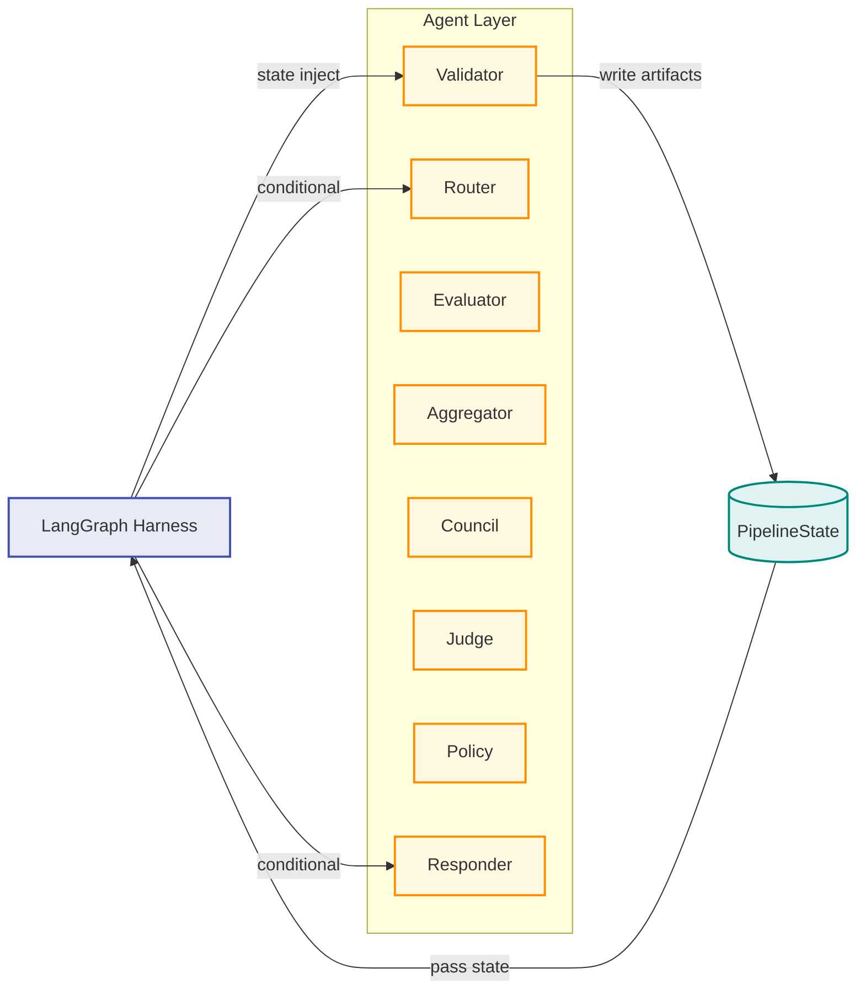

# 에이전트 하네스 아키텍처

> **분류**: 설계 · **버전**: v2.3 · **최종 수정**: 2026-04-07
>
> LangGraph `StateGraph` 기반 파이프라인의 내부 설계.
> 상태 흐름, 제어 패턴, Council 에스컬레이션을 다룬다.

---

## 상태 흐름 (State Contract)

모든 노드는 `PipelineState`라는 단일 상태 객체를 읽고 쓰는 방식으로 통신한다. 노드 간 직접 호출은 없고, 하네스가 상태를 넘겨주는 **간접 통신** 구조.

```
PipelineState
├── request_context    ← 입력 (image_path, user_id, mission_type, answer)
├── artifacts          ← 각 노드가 누적하는 중간 결과물
│   ├── gate_result         (validator)
│   ├── model_votes         (evaluator)
│   ├── ensemble_result     (aggregator)
│   ├── council_verdict     (council)
│   ├── judgment            (judge)
│   └── coupon_decision     (policy)
├── errors             ← 에러 누적 (노드명 + retryable 여부)
├── control_flags      ← 전역 플로우 제어 (terminate, manual_review, degrade_mode)
├── route_decision     ← 라우터가 기록한 분기 메타데이터
└── final_response     ← responder가 조립한 API 응답 DTO
```

---

## 하네스 제어 패턴

### 조건 분기

하네스가 노드의 출력 상태를 읽고 다음 노드를 결정한다. 에이전트 자체는 "다음에 누가 실행되는지" 모른다.

```python
add_conditional_edges("validator", _route_after_gate, ["router", "responder"])
add_conditional_edges("judge", _route_after_decision, ["policy", "responder"])
```

### 전역 제어 플래그

| 플래그 | 설정 주체 | 효과 |
|---|---|---|
| `terminate` | validator | 즉시 responder로 이동, 이후 노드 건너뜀 |
| `manual_review` | judge, council | 판정 결과에 수동 검토 필요 표시 |
| `degrade_mode` | evaluator | 모델 일부 실패 시 가용 모델로만 진행 |

### 에러 누적

각 노드는 에러를 `errors` 배열에 append한다. 하네스는 에러를 수집할 뿐 실행을 중단하지 않는다 (`terminate` 플래그 예외). Responder가 최종적으로 모든 에러를 클라이언트 응답에 포함.

```python
{"code": "METADATA_INVALID", "message": "...", "node": "validator", "retryable": False}
{"code": "MODEL_TIMEOUT",    "message": "...", "node": "evaluator", "retryable": True, "model": "qwen"}
```

---

## 하네스 다이어그램



---

## 노드 역할

| 노드 | 파일 | 역할 | 출력 |
|---|---|---|---|
| `validator` | `app/council/nodes.py` | EXIF 날짜, GPS BBox, 이미지 해시 중복 검사 | `gate_result` |
| `router` | `app/council/nodes.py` | 미션 타입 정규화 (`photo` → `atmosphere`) | `route_decision` |
| `evaluator` | `app/council/nodes.py` | 단일/앙상블 모델 선택, 추론 실행 | `model_votes` |
| `aggregator` | `app/council/nodes.py` | 가중치 기반 `merged_score` 계산, `conflict` 감지 | `ensemble_result` |
| `council` | `app/council/deliberation.py` | 3-Tier 위원회 심의 | `council_verdict` |
| `judge` | `app/council/nodes.py` | 임계값 판정 + Council 교차검증 | `judgment` |
| `policy` | `app/council/nodes.py` | 쿠폰 자격·할인율 결정 | `coupon_decision` |
| `responder` | `app/council/nodes.py` | API 응답 DTO 조립 | `final_response` |

---

## Council 3-Tier 에스컬레이션

Council 노드 내부도 하네스 패턴을 따른다. 3단계 판정자가 순차 실행되며, 결정적이면 다음 단계를 건너뛴다.

```
┌─────────────────────────────────────────────────────────┐
│                    Council Agent                        │
│                                                         │
│   Tier 1: ConsistencyJudge (규칙 기반, API 없음)         │
│     ├─ 결정적 → 종료 (early exit)                       │
│     └─ 에스컬레이션 ↓                                    │
│                                                         │
│   Tier 2: ThresholdJudge (경계값·충돌 분석, API 없음)    │
│     ├─ 결정적 → 종료                                    │
│     └─ 에스컬레이션 ↓                                    │
│                                                         │
│   Tier 3: QwenFallbackJudge (VLM 재호출, 비용 발생)     │
│     └─ 최종 판정                                        │
│                                                         │
│   출력: council_verdict                                  │
│     (approved, confidence, tier_reached, 감사 로그)      │
└─────────────────────────────────────────────────────────┘
```

대부분 Tier 1~2에서 API 없이 판정된다. Tier 3(Qwen VL 재호출)은 경계값 ±8% 케이스에만 도달.

---

## Judge → Council 오버라이드

Judge는 앙상블 점수로 1차 판정 후 Council의 `council_verdict`를 확인한다. 불일치 시 **Council이 우선**.

```
Judge (score >= threshold?) ──┐
                              ├─ 일치 → 확정
Council (approved?)  ─────────┤
                              └─ 불일치 → Council 채택 (council_override = true)
```

---

## 미션 타입별 모델 전략

| | Location | Atmosphere |
|---|---|---|
| 목표 | 사진 속 장소가 정답과 일치하는가 | 사진의 분위기가 키워드와 일치하는가 |
| 기본 모델 | SigLIP2 | SigLIP2 |
| 앙상블 가중치 | SigLIP2 60% · BLIP 40% | SigLIP2 75% · BLIP 25% |
| 통과 임계값 | 0.70 | 0.62 |
| Qwen VL 역할 | 앙상블 불참, Council Tier 3에서만 재호출 | 동일 |
| Council 개입 | 임계값 ±8% 또는 conflict(score 차 ≥0.35) | 동일 |
