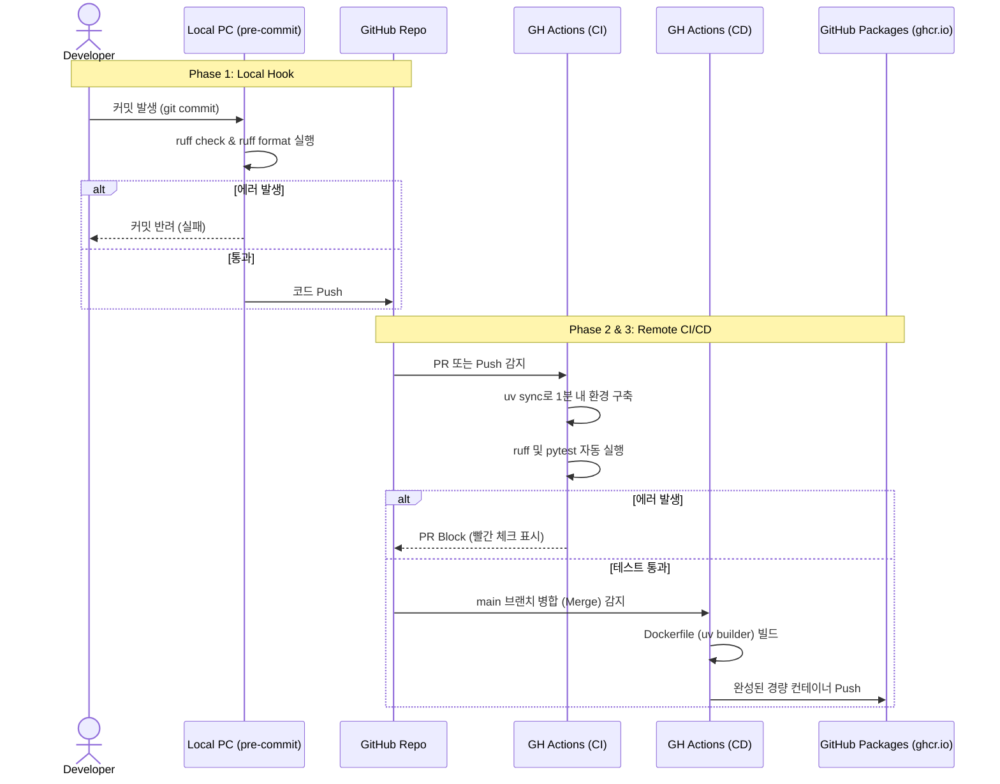

# CI/CD 자동화 파이프라인 아키텍처

> **분류**: 설계 · **버전**: v2.5.0 · **최종 수정**: 2026-04-14
>
> 로컬 환경(Agent Hook)부터 리모트(GitHub Actions)까지 연결되는 파이프라인 자동화 아키텍처 명세.

---

## 1. 아키텍처 개요

본 파이프라인은 상용 클라우드나 과금형 CI 툴 없이, **순수 로컬 툴과 무료 제공되는 GitHub Actions 인프라만으로 오직 파이프라인 원리를 구현하고 학습**하는 데 목적이 있습니다.

- **핵심 철학**: everything-claude-code(ECC)의 Agent Hook 메커니즘 차용 (수정 즉시 검증)
- **핵심 엔진**: Astral의 `uv` 패키지 관리자를 활용한 초고속 환경 구축 및 멀티스테이지 도커

---

## 2. 파이프라인 상세 다이어그램

---

## 3. 핵심 모듈 설명

### 3-1. Local Hook (Pre-commit 방어막)
- **위치**: `PAZULE/.pre-commit-config.yaml`
- **역할**: 개발자가 무심코 만든 버그나 포맷 엇나감을 원격 저장소(`main` 브랜치)로 가기 전에 내 컴퓨터에서 강제로 막는 요새 역할.

### 3-2. Remote CI (테스트 채점기)
- **위치**: `geminiProject/.github/workflows/ci.yml`
- **역할**: 누구의 코드가 들어와도 깨끗한 Ubuntu 환경에 `uv` 도구를 이용해 환경을 똑같이 깔고, 모든 테스트 케이스를 가차없이 돌려 검증하는 자동 채점기.

### 3-3. Remote CD (제품 포장 센터)
- **위치**: 
  - 설계도: `PAZULE/Dockerfile`
  - 명령서: `geminiProject/.github/workflows/cd.yml`
- **역할**: 테스트가 끝난 코드를 언제든 곧바로 서버에 돌릴 수 있도록, 껍데기만 있는 도커 박스 안에 `uv`가 인스톨해 둔 필수 파일들만 쏙 복사(\`--from=builder\`)하여 옮겨 두는 패키징 스크립트.
