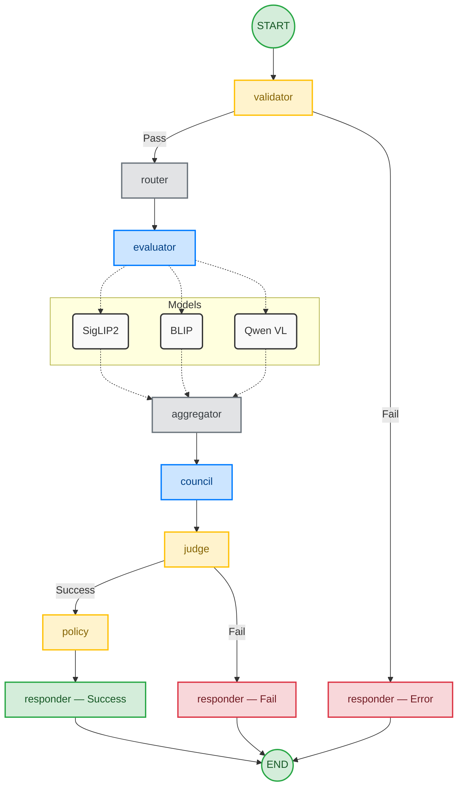

# 파이프라인 시각화

> **분류**: 레퍼런스 · **버전**: v2.3 · **최종 수정**: 2026-04-07
>
> `POST /api/mission/submit` 요청 시 실행되는 LangGraph 파이프라인의 Mermaid 다이어그램.

---

## 전체 파이프라인

---

## 참고

- 실선: 순차 실행 흐름
- 점선: 모델 fan-out / fan-in
- 조건 분기: validator 후 (gate 통과 여부), judge 후 (판정 성공 여부)
- 상세 설계: [`architecture.md`](./architecture.md)
